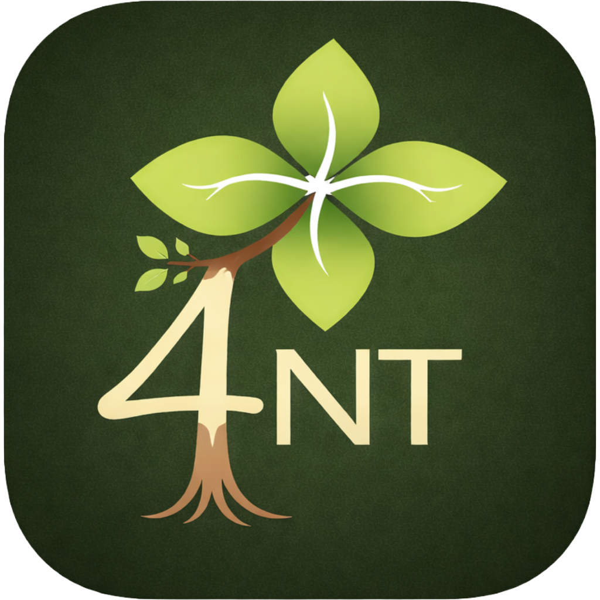

<p align="center">
  
</p>

# Suttamūla — Pāli Canon Translations

Fresh, public domain translations of the Buddhist Pāli Canon (Tipiṭaka) from Pāli into English. The name _Suttamūla_ ("root of the suttas") reflects the project's aim: to return to the root meaning of the early texts.

This project intentionally leaves many core Pāli terms untranslated — words like _dhamma_, _dukkha_, _sati_, _jhāna_, _nibbāna_ — to minimize translation bias and encourage study of the original texts. Where Pāli terms are translated, the original word is given in brackets so the reader can always trace back to the source.

All translations follow an **Early Buddhism First** approach: the plain meaning of the early suttas takes priority over later commentarial interpretation.

Translation is inherently opinionated — every rendering reflects a choice. However, this project, as an open-source endeavour, leaves editorial traces wherever such choices are made: translated Pāli terms always appear with the original word in brackets, and key terms are deliberately left untranslated so as not to foreclose meaning. Students are always encouraged to cross-check with the Pāli original.

## Core philosophy

Every translation carries the biases of its translator, and the very crafting of our prompts is no exception. However, by keeping our methodology fully transparent and encouraging readers to return to the original texts, we hope to mitigate this — at least to some extent.

Consider `sati`, the best-known Buddhist term in modern discourse. It is almost universally rendered as "mindfulness." Yet look at how the Canon itself defines the faculty of `sati`:

```
Katamañca, bhikkhave, satindriyaṁ?

Idha, bhikkhave, ariyasāvako satimā hoti paramena satinepakkena samannāgato cirakatampi cirabhāsitampi saritā anussaritā—

idaṁ vuccati, bhikkhave, satindriyaṁ.
```

Which can be rendered as:

```
And what, bhikkhus, is the faculty of mindfulness?

Here, bhikkhus, a noble disciple is mindful, endowed with supreme mindfulness and alertness, remembering and recollecting what was done and said long ago—

this, bhikkhus, is called the faculty of mindfulness.
```

"Remembering and recollecting what was said and done long ago" is not exactly how mindfulness is portrayed today, to say the least.

This is why we prefer to leave `sati` — and other key terms — untranslated, even in everyday use. When a Pāli word stays in our vocabulary, it resists the flattening that translation inevitably brings: each time we encounter it, we are drawn back to the original definition and compelled to sit with its full depth of meaning. An English gloss like "mindfulness" can feel settled and familiar, closing off inquiry; the Pāli term keeps the inquiry alive. (That said, "mindfulness" is probably still a reasonable rendering of the compound `sati-sampajaña`.)

## How it works

Translations are AI-assisted. A human-authored prompt defines the translation conventions — which terms to leave in Pāli, how to render compounds, what English style to use — and an LLM produces the translation from SuttaCentral's Pāli source texts.

The current prompt is [`PROMPT.md`](PROMPT.md). Previous prompt iterations are archived in [`prompts/`](prompts/).

Every prompt and every output is open-sourced so that the translation methodology is fully transparent and reproducible.

## Directory structure

```
.
├── PROMPT.md                          # Current translation prompt -> symbolic link to ./prompts
├── prompts/                           # Archived prompt versions (named by hash)
│   ├── 0.1.md
│   ├── 0.2.md
└── translation/                       # All translation output
    ├── <prompt-version>/                 # Translations grouped by the prompt that produced them
    │   └── <model>/                   # Grouped by the model used
    │       ├── an/                    # Anguttara Nikaya
    │       │   └── an3/an3.65.json
    │       ├── mn/                    # Majjhima Nikaya
    │       │   └── mn10.json
    │       ├── sn/                    # Samyutta Nikaya
    │       │   └── sn12/sn12.1.json
    │       └── ud/                    # Udana
    │           └── ud8.1.json
```

Each translation file is a JSON document with segment IDs matching [SuttaCentral's](https://suttacentral.net) numbering system, making it straightforward to align translations with the Pāli source or other translations.

## Collections covered

| Abbreviation | Collection                                 | Status      |
| ------------ | ------------------------------------------ | ----------- |
| SN           | Samyutta Nikaya (Connected Discourses)     | In progress |
| MN           | Majjhima Nikaya (Middle Length Discourses) | In progress |
| AN           | Anguttara Nikaya (Numerical Discourses)    | In progress |
| UD           | Udana (Inspired Utterances)                | In progress |

## Translation principles

- **No abbreviation**: repetitive passages are translated in full, as they appear in the original
- **Early Buddhism First**: the suttas speak for themselves, without commentarial overlay
- **Pāli terms preserved**: ~40 core terms are left untranslated (see `PROMPT.md` for the full list)
- **Transparency**: translated terms always include the original Pāli in brackets
- **Consistency**: stock formulas are rendered identically across suttas
- **Modern English**: fluent and clear, neither archaic nor overly casual

## Source data

Pāli source texts come from SuttaCentral's [bilara-data](https://github.com/suttacentral/bilara-data) repository, which provides segmented Pāli texts in JSON format.

## Prompt history

The translation prompt will likely evolve through several iterations, as we review the translations gradually. Each version is archived by its content hash in the [`prompts/`](prompts/) directory.

| Prompt                  | Key changes                                                                                                                                  |
| ----------------------- | -------------------------------------------------------------------------------------------------------------------------------------------- |
| [`0.1`](prompts/0.1.md) | Initial prompt. Established core principles: untranslated Pāli terms, Early Buddhism First approach, no abbreviation of repetitive passages. |

[`PROMPT.md`][./PROMPT.md] always links to the latest version.

## Contributing

Contributions, corrections, and suggestions are welcome. In particular:

- **Translation accuracy**: if you spot a mistranslation or an awkward rendering, open an issue
- **Prompt improvements**: suggestions for refining the translation prompt
- **Coverage**: requests for specific suttas or collections

## Data format

Each `.json` file contains a flat object mapping segment IDs to translated text:

```json
{
  "sn1.1:0.1": "The Connected Discourses 1.1 ",
  "sn1.1:0.2": "1. The Reed Chapter ",
  "sn1.1:0.3": "Crossing the Flood ",
  "sn1.1:1.1": "Thus have I heard—",
  "sn1.1:1.2": "at one time the Bhagavā was dwelling ..."
}
```

Segment IDs follow SuttaCentral conventions: `<sutta>:<section>.<segment>`.

## Supported by

<a href="https://4nt.org" target="_blank">
    
</a>

This project is supported by the [Early Buddhism Meditation Preservation Society](https://4nt.org) (EBMPS), a registered nonprofit in California.

## License

[The Unlicense](LICENSE) — released into the public domain. Use freely for any purpose.
